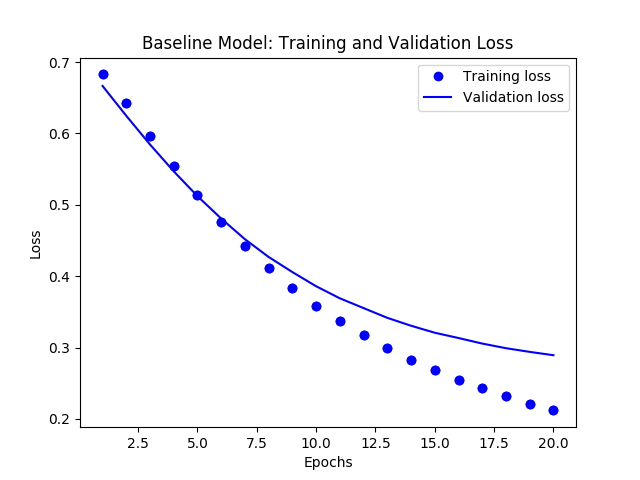
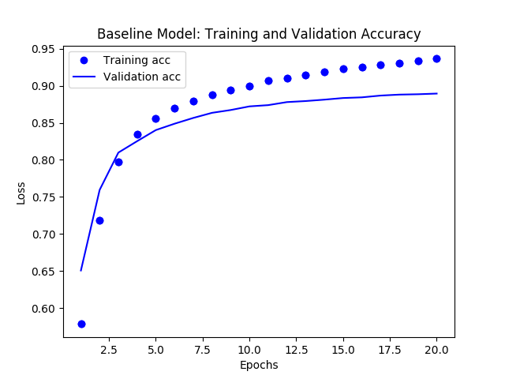

# Sentiment analysis with imdb DataSet
This is a collection of MLflow project examples that you can directly run with mlflow CLI commands or directly using Python.

## 1. Keras MLP Binary Classification Model.

This is a simple Keras neural network model with three layers, one input, one hidden,
and one output layer. It's a simple linear model: `y=Mx`. Given a random numbers of X values,
it learns to predict it's Y value, from a training set.

You can use other network models from this gist in a similar fashion to experiment. 

The arguments to run this simple MLP Keras network model are as follows:

* `--drop_rate`: Optional argument with a default value is `0.5`.
* `--input_dim  `: Input dimension. Default is `20`.
* `--bs`: dimension and size of the data. Default is `(1000, 20)`
* `--output`: Output to connected hidden layers. Default is `64`.
* `--train_batch_size`: Training batch size. Default is `128`
* `--epochs`: Number of epochs for training. Default is `20`.

To experiment different runs to evaluate metrics, you can alter the arguments, for example, 
expand the size of network by providing more `output` to the hidden layers. Or you 
may change the `drop_rate` or `train_batch_size` — all will alter the loss and 
accuracy of the network model.

To run the current program with just python and yet log all metrics, use
the following command:

`python keras/keras_nn_model.py`

`python keras/keras_nn_model.py --output=128 --epochs=10`

`python keras/kerasdnn/main_nn.py --output=128 --epochs=10`

It will log metrics and parameters in the `mlruns` directory. 

Alternatively, you can run using the `mlflow` command.

`mflow run . e -keras-nn-model`

`mlflow run . -e keras-nn-model -P drop_rate=0.3 -P output=128`


## 2. Classifying Movie Reviews: a Keras binary classification example.
Two-class classification, or binary classification, may be the most widely applied kind of machine learning problem. In this example, we 
will learn to classify movie reviews into "positive" reviews and "negative" reviews, just based on the text content of the reviews.

This example creates two types of models for you to work with. First, it creates a baseline model with default
parameters:

 * loss function as `rmstrop`
 * `binary_crossentropy` for metrics
 * learning rate as 0.001
 * a Keras neural network model with
    * An input layer with  input_shape (10000, )
    * 1 hidden layer with output = 32 
    * 1 Output layer with output = 1
    * All layers use `relu` as an activation function except for `sigmod` that is used in the final output layer.
  * epochs = 20; batch_size=512
 
 And the second model can me created for experimenting by changing any of the these parameters to measure the metrics:
 
  * Use 2 or more hidden layers
  * Use 4, 8, 12 or 16 epochs
  * Try hidden layers with output 32, 64 or 128 and see if that affects the metrics
  * Try to use the `mse` loss function instead of `binary_crossentropy`.
  
  In both cases, the model will create images for training and validation loss/accuracy images in the images directory
  
  
  
  
  
 ### How to Use MLflow to Experiment, Log Metrics and Artifacts
 
 To run the current program with just python and default or supplied parameter and yet log all metrics, use
the following command:

`cd imdbclassifier`

`python main_nn.py`

**Note**: You will need to do `pip install imdbclassifier`

To experiment different runs, with different parameters suggested above, and evaluate new metrics, you can alter the arguments. For example, 
expand the size of network by providing more `output` to the hidden layers. Or you 
may change the `hidden_layers` or `epochs` or `loss` function — all will alter the loss and 
accuracy of the network model. For example,

```
python main_nn.py  # hidden_layers=1, epochs=20 output=16 loss=binary_crossentropy
python main_nn.py --hidden_layers=3 --output=16 --epochs=30 --loss=binary_crossentropy 
python main_nn.py --hidden_layers=3 --output=32 --epochs=30 --loss=mse
```

It will log metrics and parameters in the `mlruns` directory. 

Alternatively, you can run using the `mlflow` command.

**Note**: `mlflow run..` may take longer as it needs to create and setup an environment by and download and
installing dependency packages listed in `conda.yml`

`mlflow run keras/imdbclassifier -e main`

`mlflow run keras/imdbclassifier -e main -P hidden_layers=3 -P output=32 -P epochs=30 -P loss=mse`

 To view the output of either runs, launch the mlflow ui:
 
 `mlflow ui`
 
 
 Finally, you can run this in a Jupyter Notebook: 
 
 
 
 ### How to Use MLflow to Load Saved Model
 When executing your test runs, the models used for these runs are also saved via the `mlflow.keras.log_model(model, "models")` within `train_nn.py`.  Once you have found a model that you like, you can re-use your model using MLflow as well.  Your Keras model is saved in HDF5 file format as noted in [MLflow > Models > Keras](https://mlflow.org/docs/latest/models.html#keras-keras).  
 
This model can be loaded back as a `Python Function` as noted noted in [`mlflow.keras`](https://mlflow.org/docs/latest/python_api/mlflow.keras.html#module-mlflow.keras) using `mlflow.keras.load_model(path, run_id=None)`.

To execute this, you load the model you had saved within MLflow by going to the MLflow UI, selecting your run, and copying the path of the stored model as noted in the screenshot below.  


Using the code sample `reload_nn.py`, you can load your saved model and re-run it using the command:

```
python reload_nn.py --hidden_layers=3 --output=32 --load_model_path='/Users/dennylee/github/jsd-mlflow-examples/keras/imdbclassifier/mlruns/0/55d11810dd3b445dbad501fa01c323d5/artifacts/models'
```
```
mlflow run keras/imdbclassifier -e reload -P output=4 -P load_model_path=/Users/jules/jsd-mlflow-examples/keras/imdbclassifier/keras_models/178f1d25c4614b34a50fbf025ad6f18a
```

### How to Reproduce a Run or an Experiment
As part of machine development life cycle, reproducibility of any experiment by team members or ML developers is imperative. Often you will want to either retrain or reproduce a run from several past experiments to reproduce the results for sanity or audibility.

One way is to manually read the parameter from the MLflow UI for a particular `run_uuid` and rerun using `main_nn.py or reload_rn.py,` with the original parameters arguments.

Another preferred way is to simply use `run_uuid`, and use it with `reproduce_nn.py.` This command will fetch all the right hyper-parameters used for training the model and will recreate or reproduce 
the experiment, including building, training, and evaluating the model. To see the code how the new [Python tracking and experimental APIs](https://mlflow.org/docs/latest/python_api/mlflow.tracking.html) are used, read the source `reproduce_nn.py.`

You can run these either of two ways:

```
python reproduce_run_nn.py --run_uuid=7261d8f5ae5045d4ba16f9de58bcda2a
python reproduce_run_nn.py --run_uuid=7261d8f5ae5045d4ba16f9de58bcda2a [--tracking_server=URI]
```
Or

```
mlflow run keras/imdbclassifier -e reproduce -P run_uuid=7261d8f5ae5045d4ba16f9de58bcda2a
mlflow run keras/imdbclassifier -e reproduce -P run_uuid=7261d8f5ae5045d4ba16f9de58bcda2a [--tracking_server=URI]
```
The output from the above runs. By default the `tracking_server` defaults to
the local 'mlruns' directory.
...

The output from the above runs. By default the `tracking_server` defaults to
the local 'mlruns' directory.
```
...
Using TensorFlow backend.
run_uuid: 5374ba7655ad44e1bc50729862b25419
hidden_layers: 4
output: 4
epochs: 25
loss: mse
load model path: /tmp
tracking server: None
2018-09-12 10:25:24.378576: I tensorflow/core/platform/cpu_feature_guard.cc:141] Your CPU supports instructions that this TensorFlow binary was not compiled to use: SSE4.1 SSE4.2 AVX AVX2 FMA
Experiment Model:
Writing TensorFlow events locally to /var/folders/b7/01tptb954h5_x87n054hg8hw0000gn/T/tmpiva13sry

Train on 15000 samples, validate on 10000 samples
Epoch 1/25
15000/15000 [==============================] - 3s 189us/step - loss: 0.2497 - binary_accuracy: 0.5070 - val_loss: 0.2491 - val_binary_accuracy: 0.4947
